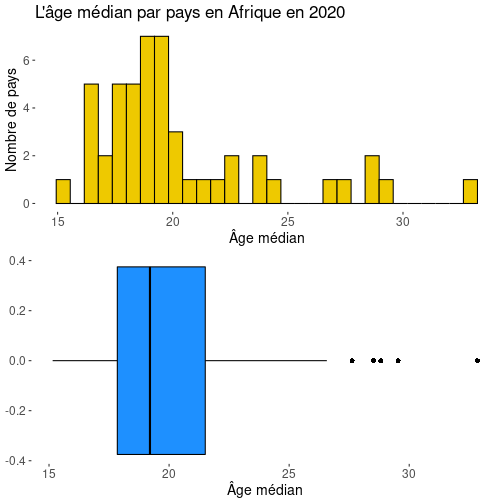
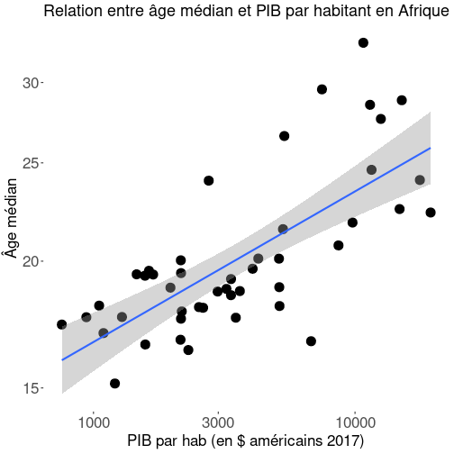
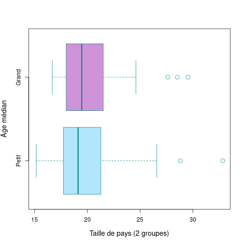
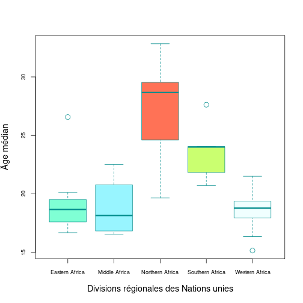

## Introduction

• Ce document questionne la variable Y de l'âge médian et vise à analyser pour les 48 pays du continent africain le rapport entretenu par cette variable avec d'autres caractéristiques : la taille démographique, la situation géographique et la richesse.

• Les travaux qu'il comporte sont appuyés sur le Rapport Mondial sur le Développement Humain des Nations unies de l'année 2020. Ils sont basés sur des données de 2018 ou de 2019 (cela dépend des pays), et se basent donc sur une photographie du monde d'avant la pandémie de COVID19.

• Il cherche à vérifier les trois hypothèses suivantes :
- H1 : Y a-t-il une relation entre âge médian et PIB par habitant ?
- H2 : Y a-t-il une relation entre âge médian et le fait qu'un pays soit grand ou petit ?
- H3 : Y a-t-il une relation entre l'âge médian et la localisation d'un pays à l'échelle de l'Afrique ?

--- .class1 #id1 bg:url(assets/img/background.png)

## Détail des variables des hypothèses

• **H1** : âge médian et PIB par habitant (On a choisi de mesurer la richesse des pays en fonction de leur PIB par habitant)

• **H2** : âge médian et taille du pays (Le pays est défini grand ou petit en fonction d'un seuil de 25 millions d'habitants)

• **H3** : âge médian et région d'Afrique définie par les Nations unies :
- Afrique de l'Ouest
- Afrique de l'Est
- Afrique centrale
- Afrique du Nord
- Afrique du Sud

--- .class1 #id1 bg:url(assets/img/background.png)

## Distribution de l'âge médian

 
 • L'âge médian des pays d'Afrique est une variable à la distribution unimodale mais non gaussienne.
  
  
  • La distribution est marquée par quelques valeurs extrêmes au-delà du quatrième quartile.
   
  
 • En Afrique, le pays à l'âge médian le plus faible a un âge médian de 15, tandis que le pays à l'âge médian le plus élevé a un âge médian de 30 ; et la médiane des âges médians des pays africains est de 19.

  

--- .class1 #id1 bg:url(assets/img/background.png)

## H1 : Graphique de régression de l'âge médian (Y) avec le PIB par habitant (X) : Y = f(X)

 

 On observe clairement via la droite de régression Y = f(X) une corrélation positive entre l'âge médian et le PIB par habitants. Bien que la corrélation ne soit pas parfaite, il y a d'évidence, de manière générale, un lien entre âge médian et PIB par habitant ; plus ce dernier est élevé, et plus l'âge médian l'est aussi.

  

 

 

---

## H1 : Significativité de l'hypothèse
<!-- html table generated in R 3.6.3 by xtable 1.8-4 package -->
<!-- Fri Apr 15 22:22:52 2022 -->
<table border=1>
<tr> <th>  </th> <th> Estimate </th> <th> Std. Error </th> <th> t value </th> <th> Pr(&gt;|t|) </th>  </tr>
  <tr> <td align="right"> (Intercept) </td> <td align="right"> 17.5207 </td> <td align="right"> 0.6440 </td> <td align="right"> 27.21 </td> <td align="right"> 0.0000 </td> </tr>
  <tr> <td align="right"> X </td> <td align="right"> 0.0006 </td> <td align="right"> 0.0001 </td> <td align="right"> 6.15 </td> <td align="right"> 0.0000 </td> </tr>
   </table>

 
  

On constate que la valeur P du test de Student effectué entre les variables de l'âge médian et du PIB par habitant est de **3.726e-09**, ce qui est très nettement inférieur à 0,05. L'hypothèse nulle est par conséquent rejetée : on ne saurait considérer que la relation entre âge médian et PIB par habitant est l'effet du hasard.

--- .class1 #id1 bg:url(assets/img/background.png)

## H2 : Comparaison par les boites à moustache de l'âge médian des petits et grands pays : Y = f(B)

 
 On voit sur les deux boites à moustache ci-contre, l'une représentant les petits pays, et l'autre les grands pays, que les âges médians des petits pays varient plus que ceux des grands pays, mais que la médiane des âges médians des grands pays est légèrement plus élevée.

  

---

## H2 : Significativité de l'hypothèse
<!-- html table generated in R 3.6.3 by xtable 1.8-4 package -->
<!-- Fri Apr 15 22:22:52 2022 -->
<table border=1>
<tr> <th>  </th> <th> Estimate </th> <th> Std. Error </th> <th> t value </th> <th> Pr(&gt;|t|) </th>  </tr>
  <tr> <td align="right"> (Intercept) </td> <td align="right"> 20.0938 </td> <td align="right"> 0.6941 </td> <td align="right"> 28.95 </td> <td align="right"> 0.0000 </td> </tr>
  <tr> <td align="right"> BGrand </td> <td align="right"> 0.6251 </td> <td align="right"> 1.1783 </td> <td align="right"> 0.53 </td> <td align="right"> 0.5983 </td> </tr>
   </table>
 
On constate que la P value des variables de H2 est de **0.5983**, ce qui est largement supérieur à 0,05. Par conséquent, l'hypothèse nulle est validée, et on ne saurait statuer que les résultats de la présente analyse ne sont pas l'effet du hasard.

--- .class1 #id1 bg:url(assets/img/background.png)

## H3 : Comparaison par les boites à moustache de l'âge médian selon les régions africaines : Y = f(Q)

 
 On constate d'après le graphique que l'âge médian des pays est plus élevé dans certaines régions d'Afrique que d'autres. Là où la médiane des âges médians des pays est similaire entre les trois régions de l'Afrique de l'ouest, de l'Afrique centrale et de l'Afrique de l'est, autour de 18, elle est bien plus élevée en Afrique du sud, puisqu'elle s'y approche de 25, et encore plus élevée en Afrique du nord, puisqu'elle s'approche là-bas de 30. On va tester la significativité de ces résultats dans une diapositive suivante.

  

---

## H3 : Significativité de l'hypothèse

<!-- html table generated in R 3.6.3 by xtable 1.8-4 package -->
<!-- Fri Apr 15 22:22:52 2022 -->
<table border=1>
<tr> <th>  </th> <th> Estimate </th> <th> Std. Error </th> <th> t value </th> <th> Pr(&gt;|t|) </th>  </tr>
  <tr> <td align="right"> (Intercept) </td> <td align="right"> 18.9799 </td> <td align="right"> 0.6571 </td> <td align="right"> 28.88 </td> <td align="right"> 0.0000 </td> </tr>
  <tr> <td align="right"> QMiddle Africa </td> <td align="right"> -0.1589 </td> <td align="right"> 1.1142 </td> <td align="right"> -0.14 </td> <td align="right"> 0.8872 </td> </tr>
  <tr> <td align="right"> QNorthern Africa </td> <td align="right"> 8.3494 </td> <td align="right"> 1.2293 </td> <td align="right"> 6.79 </td> <td align="right"> 0.0000 </td> </tr>
  <tr> <td align="right"> QSouthern Africa </td> <td align="right"> 4.6673 </td> <td align="right"> 1.3142 </td> <td align="right"> 3.55 </td> <td align="right"> 0.0009 </td> </tr>
  <tr> <td align="right"> QWestern Africa </td> <td align="right"> -0.4637 </td> <td align="right"> 0.9293 </td> <td align="right"> -0.50 </td> <td align="right"> 0.6203 </td> </tr>
   </table>
#### Lecture : Il y a une différence d'âge médian très peu significative (Valeur P : 0,8872 > 0,05) de -0.1589 entre l'Afrique de l'Est et l'Afrique centrale.
 
Il y a une très forte significativité dans les différences d'âge médian entre les pays d'Afrique de l'Est et les pays d'Afrique du Nord, et dans les différences d'âge médian entre les pays d'Afrique de l'Est et les pays d'Afrique du Sud. L'hypothèse H3 est donc validée. Il y a bien un lien entre la localisation d'un pays à l'échelle de l'Afrique, et son âge médian.

--- .class1 #id1 bg:url(assets/img/background1.png)

## Conclusion 

• H1 est une hypothèse vraie.

• H2 est une hypothèse fausse.

• H3 est une hypothèse vraie.

---

## Pour aller plus loin

Pour une analyse prolongée de la démographie des pays, il est possible d'associer les variables de l'âge médian et du PIB par habitant avec d'autres variables. Le Rapport Mondial sur le Développement Humain contient de nombreuses données utiles à ce sujet, comme par exemple le taux de mortalité infantile ou le taux de natalité chez les adolescentes.

 
  

