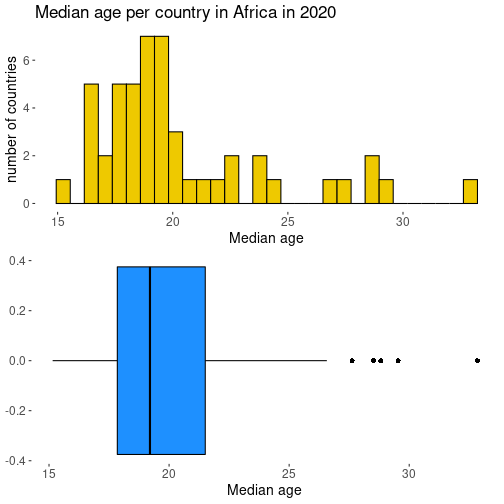
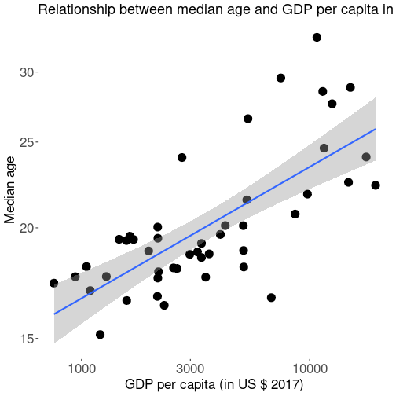
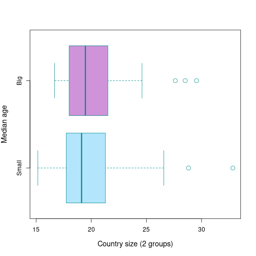
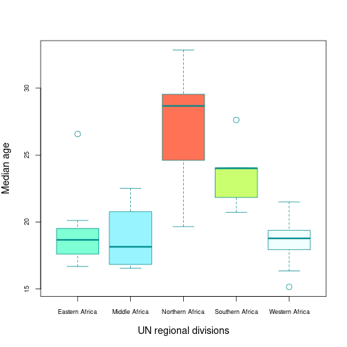

## Introduction

• This document is about the variable Y of median age and aims to analyze for the 48 countries of Africa the relationship between this variable and other characteristics : the demographic size, the geographic situation and the wealth.

• The works it contains are based on the Human Developpement Report of United Nations of the year 2020, which is based on datas recorded in 2018 or 2019 (it varies), so, on datas from before the COVID19 pandemic.

• It aims to verify three hypothesis :
- H1 : Is there a relationship between median age and GDP per capita?
- H2 : Is there a relationship between median age and the fact that a country is big or small? 
- H3 : Is there a relationship between median age and the localisation of a country at the scale of Africa?

--- .class1 #id1 bg:url(assets/img/background.png)

## Details of hypothesis variables

• **H1**: median age and GDP per capita (We choose to measure the wealth of countries relatively to their GPD per capita)

• **H2**: median age and size of country (The country is defined big or small relatively to a line of 25 millions inhabitants)

• **H3**: median age and African regions defined by United Nations:
- Western Africa
- Eastern Africa
- Middle Africa
- Northern Africa
- Southern Africa

--- .class1 #id1 bg:url(assets/img/background.png)

## Median age distribution

 
 • The median age of African countries is a variable with an unimodal distribution which isn't gaussian.
  
  
  • The distribution is marked by some extreme values beyond the fourth quartile.
   
  
 • In Africa, the country with the lowest median age has a median age of 15, while the country with the highest median age has a median age of 30; and the median of median ages of African countries is 19.

  

--- .class1 #id1 bg:url(assets/img/background.png)

## H1 : Regression plot of median age (Y) with GDP per capita (X): Y = f(X)

 

 We can clearly see via the regression line Y = f(X) a positive correlation between median age and GDP per capita. Although the correlation is not perfect, there is clearly a general link between median age and GDP per capita; the higher the latter, the higher the median age.

  

 

 

---

## H1 : Significance of the hypothesis
<!-- html table generated in R 3.6.3 by xtable 1.8-4 package -->
<!-- Fri Apr 15 22:24:24 2022 -->
<table border=1>
<tr> <th>  </th> <th> Estimate </th> <th> Std. Error </th> <th> t value </th> <th> Pr(&gt;|t|) </th>  </tr>
  <tr> <td align="right"> (Intercept) </td> <td align="right"> 17.5207 </td> <td align="right"> 0.6440 </td> <td align="right"> 27.21 </td> <td align="right"> 0.0000 </td> </tr>
  <tr> <td align="right"> X </td> <td align="right"> 0.0006 </td> <td align="right"> 0.0001 </td> <td align="right"> 6.15 </td> <td align="right"> 0.0000 </td> </tr>
   </table>

 
  

We see that the P-value of the Student's t test between the variables of median age and GDP per capita is **3.726e-09**, which is much lower than 0.05. The null hypothesis is therefore rejected: the relationship between median age and GDP per capita cannot be considered to be the effect of chance. 

--- .class1 #id1 bg:url(assets/img/background.png)

## H2 : Boxplot comparison of median age for small and large countries: Y = f(B)

 
 We can see from the two boxplots there, one representing small countries and the other large countries, that the median ages of small countries vary more than those of large countries, but that the median of the median ages of large countries is slightly higher.

  

---

## H2 : Significance of the hypothesis
<!-- html table generated in R 3.6.3 by xtable 1.8-4 package -->
<!-- Fri Apr 15 22:24:24 2022 -->
<table border=1>
<tr> <th>  </th> <th> Estimate </th> <th> Std. Error </th> <th> t value </th> <th> Pr(&gt;|t|) </th>  </tr>
  <tr> <td align="right"> (Intercept) </td> <td align="right"> 20.0938 </td> <td align="right"> 0.6941 </td> <td align="right"> 28.95 </td> <td align="right"> 0.0000 </td> </tr>
  <tr> <td align="right"> BBig </td> <td align="right"> 0.6251 </td> <td align="right"> 1.1783 </td> <td align="right"> 0.53 </td> <td align="right"> 0.5983 </td> </tr>
   </table>
 
On constate que la P value des variables de H2 est de **0.5983**, ce qui est largement supérieur à 0,05. Par conséquent, l'hypothèse nulle est validée, et on ne saurait statuer que les résultats de la présente analyse ne sont pas l'effet du hasard.

--- .class1 #id1 bg:url(assets/img/background.png)

## H3 : Boxplot comparison of median age by African region: Y = f(Q)

 
 The graph shows that the median age of countries is higher in some regions of Africa than in others. Where the median of median ages of countries is similar between the three regions of West Africa, Central Africa and East Africa, at around 18, it is much higher in South Africa, where it is close to 25, and even higher in North Africa, where it is close to 30. We will test the significance of these results in the next slide.

  

---

## H3 : Significance of the hypothesis

<!-- html table generated in R 3.6.3 by xtable 1.8-4 package -->
<!-- Fri Apr 15 22:24:24 2022 -->
<table border=1>
<tr> <th>  </th> <th> Estimate </th> <th> Std. Error </th> <th> t value </th> <th> Pr(&gt;|t|) </th>  </tr>
  <tr> <td align="right"> (Intercept) </td> <td align="right"> 18.9799 </td> <td align="right"> 0.6571 </td> <td align="right"> 28.88 </td> <td align="right"> 0.0000 </td> </tr>
  <tr> <td align="right"> QMiddle Africa </td> <td align="right"> -0.1589 </td> <td align="right"> 1.1142 </td> <td align="right"> -0.14 </td> <td align="right"> 0.8872 </td> </tr>
  <tr> <td align="right"> QNorthern Africa </td> <td align="right"> 8.3494 </td> <td align="right"> 1.2293 </td> <td align="right"> 6.79 </td> <td align="right"> 0.0000 </td> </tr>
  <tr> <td align="right"> QSouthern Africa </td> <td align="right"> 4.6673 </td> <td align="right"> 1.3142 </td> <td align="right"> 3.55 </td> <td align="right"> 0.0009 </td> </tr>
  <tr> <td align="right"> QWestern Africa </td> <td align="right"> -0.4637 </td> <td align="right"> 0.9293 </td> <td align="right"> -0.50 </td> <td align="right"> 0.6203 </td> </tr>
   </table>
#### Example: There is a highly insignificant (P-value: 0.8872 > 0.05) difference in median age of -0.1589 between East and Central Africa.
 
There is very strong significance in the differences in median age between East African and North African countries, and in the differences in median age between East African and South African countries. Hypothesis H3 is therefore validated. There is indeed a link between the location of a country on the African scale and its median age.

--- .class1 #id1 bg:url(assets/img/background1.png)

## Conclusion 

• H1 is a valid hypothesis.

• H2 is an invalid hypothesis.

• H3 is a valid hypothesis.

---

## To go further

For an extended analysis of the demography of countries, it is possible to combine the variables of median age and GDP per capita with other variables. The Human Development Report contains many useful data on this subject, such as the infant mortality rate or the adolescent birth rate.

 
  

